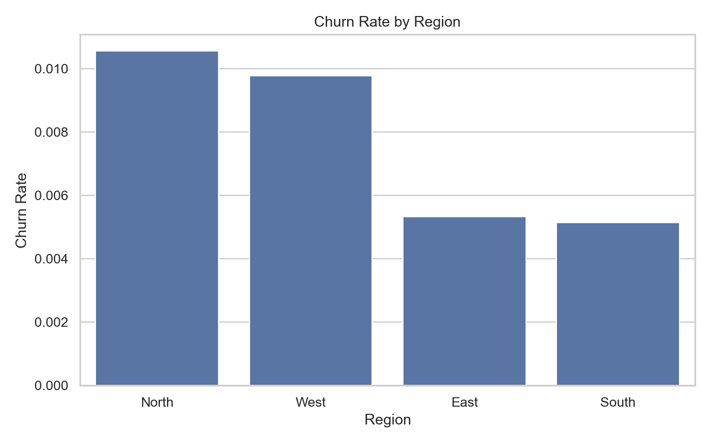
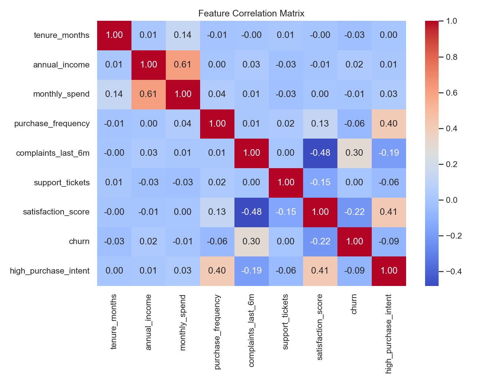

# 📊 Customer Behavior Analysis

## 🔍 Overview

This project analyzes customer data to understand purchasing behavior, satisfaction, and churn trends. It helps businesses make data-driven decisions.

---

## 🎯 Features

* Customer segmentation
* Churn analysis
* Data visualization
* Business insights generation

---

## 🛠️ Tech Stack

* Python
* Pandas
* NumPy
* Matplotlib

---

## 📁 Project Structure

data/ → dataset
output/ → charts & results
reports/ → business insights
src/ → source code

---

## 📊 Results

* Identified customer segments
* Found key churn factors
* Generated visual insights

---

## 📸 Screenshots

---

## ▶️ Run Project

git clone https://github.com/JeslinSajan/Customer-Behavior-Analysis.git
cd Customer-Behavior-Analysis
python src/main.py

---

## 👨‍💻 Author

Jeslin Sajan
